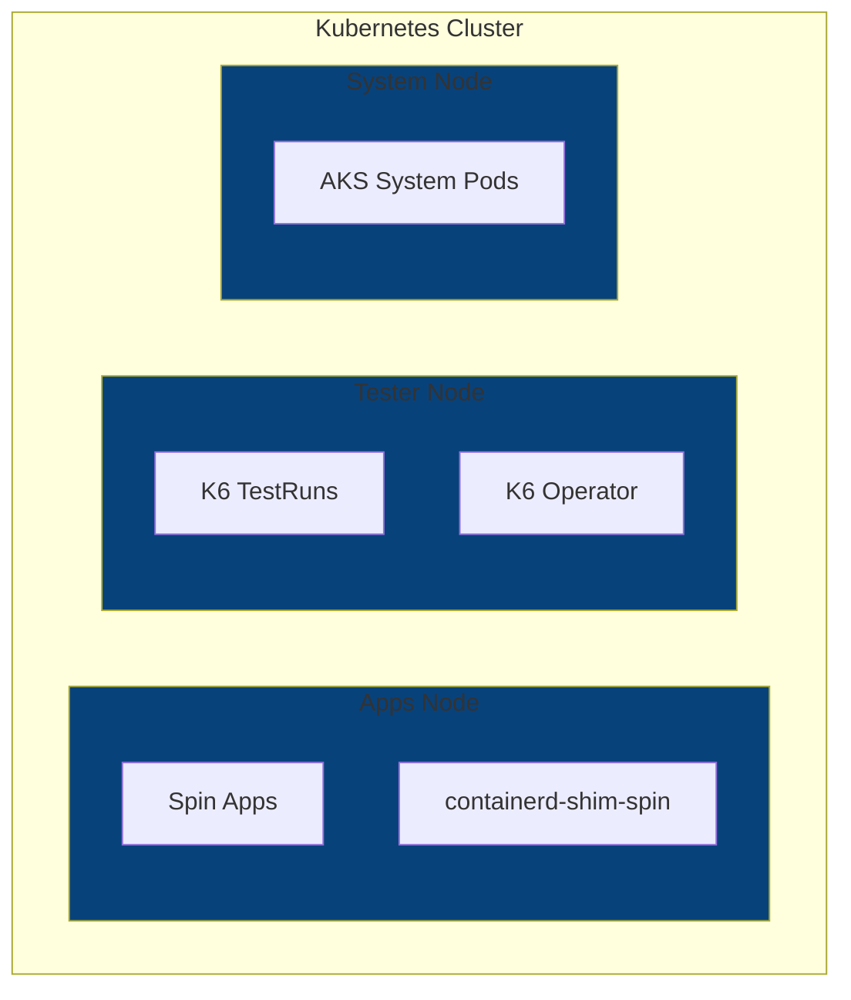

# Test Suite Installation Scripts

To install SpinKube (kwasm operator and Spin operator), K6 operator, cert manager, and Datadog on a cluster accessible with `kubectl`:

```sh
DATADOG_API_KEY=xyz SHIM_VERSION=v0.14.1 ./spin-kube-k8s.sh
```

To first provision a single node K3s or K3d cluster before installing the test suite, use `spin-kube-k3s.sh` or `spin-kube-k3d.sh`, respectively.

## Default Cluster Configuration

The cluster is configured to ensure that the K6 tester and the Spin apps are running on separate environments. This is done using node selectors during the installation of the K6 operator and Spin runtime class. The result is the following test architecture for a 3 node cluster provisioned with the [default terraform scripts](../terraform/azure/aks/).


